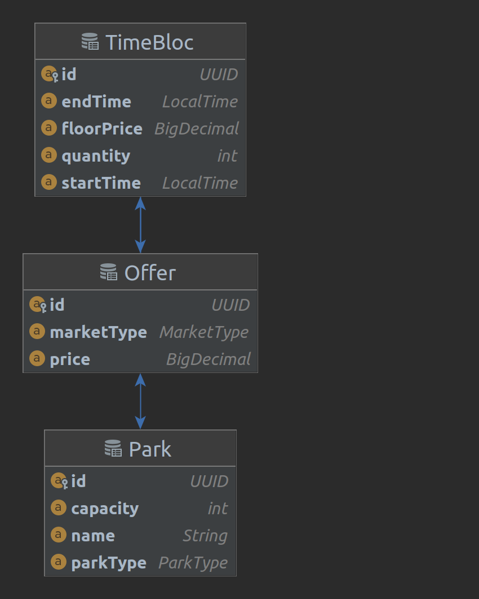

# Sales App API

## Run

Nothing special to do just run:

```shell
./mvnw spring-boot:run 
```
or 

Press the run button from your IDE.

## Stack
- Java 17
- Spring Boot 3

## Database
- H2 in memory database.
- No tool for schema migration.
- A set of data is created at startup in CommandLineRunner.
- Diagram
  

## Model
  - For Currency, I used BigDecimal type to avoid AttributeConverter while reading/writing from/to the database.
  - For the sake of simplicity I didn't have an Entity for Market. It is represented by an attribute MarketType
    in Offer entity
  - I used lombok to avoid writing boilerplate code.

## Other
- No tests written
- No Hypermedia in REST response
- No ControllerAdvice for error handling
- ...

