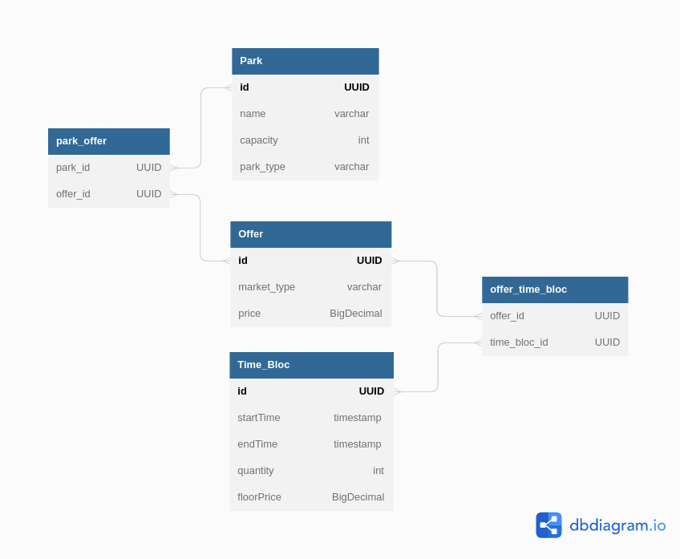

# Sales App API

## Subject


Une partie du métier d'Agregio est de vendre de l'énergie sur plusieurs marchés, il y a 3 principaux marchés, celui de la Réserve Primaire, la Réserve Secondaire et la Réserve Rapide. Sur chacun de ces marchés Agregio peut placer une offre composée de plusieurs "blocs" horaires (une journée de 24h pourrait contenir 8 blocs de 3 heures). Chaque bloc horaire présente la quantité d'énergie (en MW) qui sera produite et un prix plancher au-dessous duquel on ne vendra pas.

Les parcs producteurs d'électricité, de différents types (solaires, éoliens ou hydrauliques), sont capables de fournir un certain nombre de MégaWatt pendant la durée d'un bloc horaire. Pour permettre la traçabilité de la production électrique (garantie d'origine), on doit pouvoir connaître le(s) parc(s) qui va(vont) produire l'électricité d'une offre.

Nous vous demandons d'implémenter les APIs permettant de créer une offre, de créer un parc, de lister les offres proposées par Agregio pour chaque marché et d'obtenir la liste des parcs qui vendent sur un marché.

Nous attendons comme livrable, le code source du service qui réalise ces APIs et de tous les éléments que vous pourriez considérer nécessaire via un repo git accessible depuis internet (github/gitlab ou équivalent).

Vous avez carte blanche sur la partie technique tout en restant sur une technologie compatible avec la JVM ou Node.

Vous ne devez pas consacrer plus de 3h à cet exercice, ce qui est déjà, nous en avons conscience, un fort investissement personnel !

Nous savons aussi que la limite de temps ne vous permettra pas de terminer l'exercice, donc nous n'attendons rien de fini mais plutôt que cela reflète votre approche du développement.

## Functional
- Create a park given then `ParkCreateRequestDto`
- Create an offer given then `OfferCreateRequestDto`. To create the offer you need to specify its time blocs and the parks that can satisfy the offer.
- Get all offers from a given market
- Get all parks from a given market

## Usage

Nothing special to do just run the command:

```shell
./mvnw spring-boot:run 
```

or 

Press the run button from your IDE.

After startup the API documentation will be available here : [API documentation ](http://localhost:8080/swagger-ui/index.html)

## Stack
- Java 17
- Spring Boot 3
- Hibernate
- maven

## Database
- H2 in memory database.
- No tool for schema migration.
- A set of data is created at startup in CommandLineRunner.
- Diagram
  

## Model
  - For Currency, I used BigDecimal type to avoid AttributeConverter while reading/writing from/to the database.
  - For the sake of simplicity I didn't have an Entity for Market. It is represented by an attribute MarketType
    in Offer entity
  - I used lombok to avoid writing boilerplate code.

## What should be done
- No tests written
- No ControllerAdvice for error handling


## Author
[Mamadou Alpha BARRY](mailto:mabarry@takima.fr)
